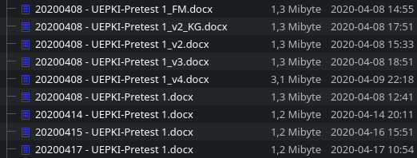

= Programmierpraktikum I: Übung 1 
:icons: font
:icon-set: fa
:source-highlighter: rouge
ifdef::env-github[]
:tip-caption: :bulb:
:note-caption: :information_source:
:important-caption: :heavy_exclamation_mark:
:caution-caption: :fire:
:warning-caption: :warning:
endif::[]
:experimental:

[quote, Rich Hickey]
Programming is not about typing, it's about thinking.


== Vertiefung `git`

Vorab: Welches Betriebssystem Sie hier verwenden, spielt in diesem Semester keine große Rolle. Da es aber viele verschiedene Kombinationen gibt, können wir leider nur sehr begrenzt bei technischen Fragen helfen. Wir setzen voraus, dass Sie sich selbst mit Ihrem System befassen und grundlegende Begriffe und Operationen erlernen und verstehen. Da wir uns am besten mit macOS und Linux auskennen, werden die Beispiele hier meistens für diese beiden Systeme geschrieben sein. Unter Windows bzw. dem WSL gibt es aber äquivalente Befehle. 

Sie haben in der Vergangenheit beim Arbeiten an Code oder gemeinsamen Erstellen von Dokumenten vielleicht schon mal am Ende so etwas hier gehabt:



Diese Art, verschiedene Versionen von Dateien zu verwalten und miteinander zu teilen wird sehr schnell unübersichtlich: Welche Änderungen gibt es wo von wem? Warum wurden die Änderungen vorgenommen? Wie kann einfach eine Änderungen zurückgenommen werden?

Um diese Probleme bei der Softwareentwicklung zu vermeiden, wurden Versionskontrollsysteme erfunden. Heute wollen wir uns mit dem weit verbreiteten Versionskontrollsystem `git` genauer befassen, denn dieses Versionskontrollsystem wird uns sowohl in diesem als auch im nächsten Semester begleiten. Aber auch quasi immer, wenn Softwareentwickler:innen an Projekten arbeiten, wird ein Versionskontrollsystem eingesetzt.

Fangen wir ganz von vorne an.

== git konfigurieren

Stellen Sie zuerst Ihre Identität ein. Diese Information wird später mit jedem Commit (Änderungssatz, „Zwischenspeicherstand“) gespeichert, damit andere Teammitglieder nachvollziehen können, wer welche Änderungen vergenommen hat:

[source, bash]
----
git config --global user.name "Ihr Name"
git config --global user.email vorname.nachname@hhu.de
----

NOTE: Wie die meisten Konsolen-Befehlen gibt `git config` nichts aus, wenn alles fehlerfrei funktioniert hat.

Für einen schöneren git Log (gucken wir uns weiter unten an), empfehlen wir den Alias `git lg` (bei Jens ist es als `git lol` abgespeichert) zu konfigurieren:

[source, bash]
----
git config --global alias.lg "log --color --graph --pretty=format:'%Cred%h%Creset -%C(yellow)%d%Creset %s %Cgreen(%cr) %C(bold blue)<%an>%Creset' --abbrev-commit"
----

Mit dem Befehl `git lg` haben Sie dann später eine schönere Darstellung des Git-Graphens.

== git Basics und Gitignore

TIP: Führen Sie ab Schritt 2 nach jedem Schritt `git status` aus und schauen Sie sich an, was git Ihnen so erzählt.

1. Erstellen Sie auf Ihrem Computer einen Ordner `uebung1` und wechseln Sie in diesen Ordner (`mkdir`, `cd`).
2. Initialisieren Sie ein git-Repository (`git init`).
3. Erstellen Sie eine Datei `README.adoc` und schreiben Sie `= Hallo :-)` in die Datei (Sie können dafür irgendeinen Text-Editor nehmen).
4. Erstellen Sie eine zweite Datei `private.key` und schreiben Sie `geheim` in die Datei.
5. Führen Sie `git status` aus. Was steht auf der Konsole? Verstehen Sie alles, was in der Ausgabe steht?
6. Wir wollen die Datei `private.key` nicht in unserem git-Repository versionieren. Damit niemand sie aus Versehen zum Repository hinzugefügt und später auf GitHub veröffentlicht, wollen wir diese Datei davor schützen. Erstellen Sie eine `.gitignore`-Datei mit dem Inhalt `private.key`. Wie sieht nun die Ausgabe von `git status` aus?
+
NOTE: Dateien mit führendem Punkt sind unter Unix-Systemen (macOS, Linux, …) versteckt. Falls Sie die Datei nach dem Anlegen nicht sehen, müssen Sie in Ihrem Dateimanager die Anzeige versteckter Dateien aktivieren oder auf der Konsole `ls` mit dem Parameter `-a` verwenden.

7. Fügen Sie die Datei `README.adoc` zur Staging-Area hinzu und erstellen Sie einen Commit mit einer aussagekräftigen Nachricht (`git add`, `git commit`).
8. Fügen Sie nun noch die `.gitignore` zur Staging-Area und erstellen Sie einen Commit mit einer passenden Nachricht.
+
TIP: Commits und ihre beschreibenden Nachrichten helfen uns nachzuvollziehen, was wir in unserem Code geändert haben und ermöglichen es uns bei sauberem und gewissenhaftem Committen auch wieder zu bestimmten Ständen zurückzuspringen. Die Nachrichten sollten daher kurz und prägnant sein und die Änderung beschreiben. Beispielsweise ist „Ignore private.key file“ ein beschreibender Titel. Nachrichten, wie „Minor change“ oder ähnliches sagen _nichts_ aus und sollten vermieden werden.
+
TIP: Mit einer gepflegten .gitignore-Datei können unliebsame Dateien von der Versionierung ausgeschlossen werden.

9. Führen Sie `git push` aus. Welche Fehlermeldung erhalten Sie und warum?
10. Erstellen Sie ein privates Repository auf GitHub und nennen Sie es `uebung1`. Initialisieren Sie das Repo _ohne_ README, gitignore oder License-Datei. Sie werden auf eine Seite weitergeleitet mit weiteren Anleitungen.
11. Führen Sie die drei Befehle aus „or push an existing repository from the command line“ in Ihrer Konsole aus.
+
IMPORTANT: Führen Sie niemals blind irgendwelche Befehle auf der Konsole aus, von denen Sie nicht wissen, was sie tun. Stellen Sie immer zuerst sicher, dass Sie wissen, was ein Befehl macht. Schauen Sie im Zweifel im Handbuch nach (z. B. mit dem Befehl `man git remote`).

12. Schauen Sie sich auf GitHub an, was Sie nun gepusht haben.
13. Mit `git lg` (alternativ: `git log`) sehen Sie auf der Konsole, welche Commits Sie nun erstellt (`HEAD`) und veröffentlicht (`origin/HEAD`) haben.

🥳 Sie haben nun die ersten Dateien gepusht, geheime Dateien werden nicht von git verwaltet und Sie können erfolgreich git verwenden!

=== Datei aus Staging Area entfernen

Dateien, die Sie aus Versehen mit `git add` zur Staging-Area hinzugefügt und noch nicht committet haben, können Sie mit `restore` wieder aus dieser Staging Area entfernen.

1. Ändern Sie die Datei `README.adoc` und fügen Sie irgendeine Zeile unten an.
2. Rufen Sie `git status` auf.
3. Fügen Sie die Datei zur Staging Area hinzu (`git add`).
4. Rufen Sie `git status` auf.
5. Folgen Sie der Anweisung von git, um die Änderungen im Arbeitsbereich (= Staging Area) zu verwerfen (`git restore …`).
6. Rufen Sie `git status` auf. Die Datei sollte nun nicht mehr zum Commit vorgemerkt sein.
7. Wenn Sie eine Änderung an einer Datei noch nicht mit `git add` zur Staging Area hinzugefügt haben, können Sie mit `git restore` die Datei wieder auf den Stand des letzten Commits zurücksetzen.

=== Advanced: Commit-Nachrichten ändern

Commits sollten in der Regel nicht verändert werden. Wenn Sie den Commit aber noch nicht veröffentlicht haben (`git push`), dann können Sie einfach lokal noch Änderungen vornehmen, beispielsweise einen Tippfehler in der Commit-Nachricht korrigieren:

1. Fügen Sie eine Zeile in die README.adoc-Datei ein: `echo "Huhu" >> README.adoc`
2. Erzeugen Sie einen Commit: `git add README.adoc && git commit -m "Extent README"`
3. Huch! `Extend` schreibt man doch mit `d`!
4. Rufen Sie `git commit --amend` auf.
5. Ändern Sie die Commit-Nachricht.
6. Schauen Sie im `git log` nach, ob die Nachricht geändert wurde.

TIP: `amend` verändert den Commit und erstellt einen neuen Hash (diese Hexadezimalzahl, die immer bei den Commits steht). Sollten Sie den Commit schon gepusht haben, so kann git diese Änderungen nicht mehr ohne Probleme zusammenführen. Daher sollten Sie aufpassen, wann Sie Commit-verändernde Operationen durchführen.

=== Advanced: Zeitreisen für Einsteiger:innen

Möchten Sie auf einen Commit zurückgehen, können sie diesen „auschecken“ (`git checkout`), also auf den Stand dieses Commits zurückgehen. Dabei können Sie einen beliebigen Commit-Hash anspringen und schauen in welchem Zustand sich Ihr Projekt zu dieser Zeit befand.

1. Führen Sie `git lg` aus.
2. Suchen Sie sich aus einen Commit-Hash in der Vergangenheit aus. Beispielsweise `bf1079e` aus diesem Beispiel
+
[source,bash]
----
uebung1 on main 
❯ git lg
* 54568a5 - (HEAD -> main, origin/main) Rename file (vor 54 Minuten) <Christian Meter>
* 91fb12c - Ignore private.key (vor 86 Minuten) <Christian Meter>
* bf1079e - Initialize propra (vor 86 Minuten) <Christian Meter>
----

3. Springen Sie zu diesem Commit mit: `git checkout bf1079e`
4. Schauen Sie sich die Dateien in Ihrem aktuellen Verzeichnis an. Es sollte nun keine .gitignore mehr zu sehen sein.
5. Springen Sie zum aktuellsten Commit zurück: `git checkout main`

TIP: Sie können auch Ihr lokales Repository hart auf einen Commit-Stand zurücksetzen. Dabei gehen alle anderen Dateien verloren, die es zu dem Zeitpunkt noch nicht gab und von git erfasst wurden. Das funktioniert mit `git reset --hard <hash>`, aber beachten Sie dabei bitte unbedingt, dass Dateien und Veränderungen verloren gehen können!!! Das ist wichtig zu wissen.

=== Advanced: Aus Versehen hinzugefügte Dateien aus git wieder entfernen

Wurde aus Versehen eine Datei zum Repository hinzugefügt, die nicht von git erfasst werden sollte, kann diese mit `git rm --cached <datei>` aus git gelöscht, aber lokal behalten werden. Probieren Sie das mit einer Datei `private2.key` aus, welche Sie zunächst hinzufügen und dann wieder aus git entfernen möchten.

NOTE: Eine Datei aus der Commit-Hostorie zu entfernen ist schwieriger. Wir schauen uns das später im Praktikum an, wenn wir uns mit weiteren Funktionen von git befassen.

== Git-Repositories klonen

Wir arbeiten fast ausschließlich mit git, sei es zum praktischen Entwickeln von Software oder auch zum Zusammenstellen von Aufgaben für Sie. Daher erhalten Sie häufig einen GitHub-Classroom-Link, der Sie zu einem git-Repository führt. Diese Repos kann man auch lokal herunterladen und dort weiterarbeiten. 

1. Öffnen Sie das Repository mit dieser Aufgabenbeschreibung in Ihrem Browser.
2. Suchen Sie den grünen CODE-Button auf der Webseite von GitHub.
3. Stellen Sie sicher, dass `SSH` ausgewählt ist, und kopieren Sie die angezeigte Adresse.
4. Falls Sie noch im Ordner `uebung1` aus den vorherigen Schritten sind, so wechseln Sie verlassen Sie bitte das Verzeichnis und gehen Sie in einen anderen Ordner, bspw. in das übergeordnete Verzeichnis. (`cd ..`)
5. Klonen Sie das Repository: `git clone <die Adresse aus Schritt 3>`, beispielsweise: `git clone git@github.com:hhu-propra1/uebung-1-ihrnutzername.git`
6. Sie haben nun das Repository lokal verfügbar und können darin arbeiten. Mit `git log` sehen Sie die letzten Commits.


== Weiterführende Themen

=== gitignore-Vorlagen

Es gibt allerlei Vorlagen zu gitignore-Dateien. Beispielsweise können Sie unter https://gitignore.io/ eine gitignore-Datei generieren lassen, die temporäre und automatisch generierte Dateien von Betriebssystemen, Editoren und Programmiersprachen beinhaltet. Diese können Sie als Basis für Ihr Projekt verwenden.

=== Git-Prompt

Sie haben bei manchen Entwickler:innen vielleicht schon gesehen, dass sich die Prompt (die Textzeile im Terminal, hinter der Befehle eingetippt werden) verändert, wenn das aktuelle Verzeichnis zu einem git-Repo gehört:

```
~/propra % cd uebung1
(main↑1)~/propra/uebung1 %
```

In diesem Beispiel wird angezeigt, dass der aktuell gewählte Branch `main` heißt und ein Commit noch nicht gepusht ist. Wie Sie das für Ihre Konsole einrichten, hängt davon ab, welche Shell Sie verwenden (das ist grob gesagt das Programm, das innerhalb des Konsolenfensters ausgeführt ist und für das Entgegennehmen von Befehlen zuständig ist); Sie können meistens mit `echo $SHELL` herausfinden, welche Shell Sie verwenden. Suchen Sie dann im Internet nach `git prompt <Name der Shell>`, um herauszufinden, wie Sie die git-Statusinformationen in der Promptzeile anzeigen lassen können.

NOTE: Was ein Branch ist und wie man sinnvoll damit arbeitet, erklären wir Ihnen später im Semester.
